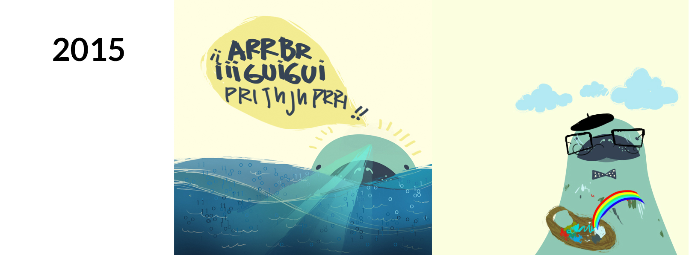
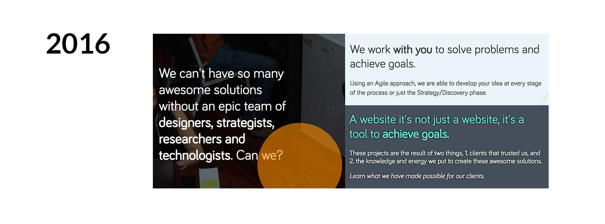

# Comunicación

* Idiomas
* Canales
  * Protocolo (como deberían contestar, etc)
  * Público meta en cada canal
* Tono
* Mensaje / Esencia
* Guía para generar una Campaña en RRSS

### Idiomas
* Español: Facebook
* Inglés: Todas las otras redes sociales

### Canales
* Sitio Web
* *Blog*
* Redes Sociales
  * [Twitter](https://twitter.com/estudiomanati)
  * [Facebook](https://www.facebook.com/estudiomanati/)
  * [Medium](https://medium.com/manati-web-agency)
  * [LinkedIn](https://www.linkedin.com/company/3823585)
  * [Drupal.org](https://www.drupal.org/manat%C3%AD)

### Protocolo

#### Cómo se debería contestar
Aunque pareciera obvio, hay que contestarle a los usuarios lo más pronto posible, aún así hay varios tiempos para contestar según el canal, por ejemplo:

* **Twitter**, debe contestarse en menos de 12h
* **Facebook**, debe contestarse en un rango de 12h - 24 horas (preferible antes)
* **Medium**, no tiene mensajes, pero si hubieran comentarios, debe contestar el autor del artículo en tiempo de 1 semana.
* **LinkedIn** y **Drupal.org** casi nunca tiene mensajes o nunca, pero igual 1 semana.

Además es bueno contestarle siempre a esta persona con el mismo idioma que nos escribe, por ejemplo:
* Si alguien nos escribe en twitter (donde escribimos en inglés) y nos escribe en español, entonces debemos contestarle en español.

Igual, puede que pareciera obvio, pero cualquiera de estos canales es la marca de Manatí y todos pueden verlo, así que si hay un amigo que pregunta, contesta, dice algo sobre Manatí, es la marca quien responde, no usted como amigo. Esto no signfica que todos los mensajes deben ser sin amor y alma, es sólo que hay que tener en cuenta que es la marca y no uno como amigo/conocido de esa persona, es Manatí como amigo/conocido de ese individuo.

#### Cuándo contestar
Siempre es clave saber de dónde nos está hablando la persona, esto para identificar hora que mejor se pueda adaptar al usuario y no contestarle a las 3am en su zona horaria.

#### Gobernanza
Siempre es ideal saber quién tomará control de que red social, lo principal es tener a una persona dedicada a esto, pero como no es posible, entonces ver si es posible tener 1 persona o si fuera el caso 2 personas. Cada persona con sus redes sociales distintas. 

Esto debe quedar claro para saber quién va publicar qué y cuándo, así como para saber si alguien escribió en dos redes sociales o si sólo fue en twitter, por ejemplo.

#### Frecuencia de Publicaciones
Aunque normalmente se recomienda a las empresas postear al menos cada 15 días, como esto no es el fuerte de Manatí, uno puede pensar en publicar no cada cierto tiempo sino cuando hay algo que valga la pena comunicar.

Es decir, no ver las publicaciones como un requisito que hay cumplir sino como una oportunidad de comunicar qué está pasando en Manatí, hacia donde va, qué es lo que está haciendo, qué es lo que desea, etc.

### Tono
La marca Manatí es un reflejo al mundo de lo que es el equipo, es decir, debe reflejar lo que queremos proyectar hacia afuera de lo que somos. 

Para hacer esto de la forma más sencilla, es imaginarse a Manatí como una persona y darle personalidad, por lo que voy a describir el Manatí que me he imaginado en este tiempo, que evidente mente ha cambiado a lo largo del tiempo, tal y como lo hace una persona.

#### 2015:
Manatí es un ser que le gusta la tecnología y de hecho nada en 1s y 0s, pero también tiene su parte creativa, le gusta el buen diseño y nadar hacia lugares para mejorar lo que se encuentra. 

Prácticamente se enfoca en crear sitios técnicamente bien pensados y a la vez bien diseñados.

#### 2016:
Para el 2016, Manatí se volvió una persona mucho más retadora, su forma de ver el mundo evolucionó y ahora tiene más experiencia, más ganas de solucionar problemas y cuestionar al cliente, no por ganas sino para ayudarle a mejorar su forma de hacer cosas.

En el 2016, a pesar de que ya antes tenía un gran enfoque en el equipo, el 2016 fue el año que se planteó poder tener un dinero específicamente para ir a conferencias y demás. Manatí ahora no es esta división entre tecnología y diseño, sino que es un [equipo impulsado](https://medium.com/manati-web-agency/impulsar-profesionalmente-el-equipo-as%C3%AD-lo-hacemos-en-manat%C3%AD-59a4a7177ef5#.dhxru6cm2) a crear soluciones junto con el cliente, dándole guía e impulsando el negocio del cliente.

### Mensaje / Esencia
Hemos venido explicando poco a poco lo que es Manatí, el tono es mucho de su esencia, sobre qué trata Manatí. Acá lo importante es entender que Manatí no va tener un mensaje nuevo cada semana, ni tampoco va ser el mismo toda la vida, sino que estos mensajes van a cambiar según la estrategia de negocio.

La esencia seguirá siendo la misma, la cual es el tono que hablo antes, irá evolucionando, pero seguirá siendo Manatí, cuando la gente vea los roller ups, cuando vean el sitio web, cuando lean una actualización en facebook, twitter o cuando lean una publicación en el blog/medium de Manatí. Todo tiene que ir ligado a este ser imaginario que ya todas las personas han empezado a crear y hay que seguir dándole vida hacia donde el negocio ve conveniente.

Aún así, habíamos determinado ciertos mensajes para desarrollar en el 2015 y están en este [documento de drive](https://docs.google.com/document/d/1JHEC083d3-q55LI-T-XYRGkQZSe5IT2CHqTUfMXXRqE/edit#).

## Guía de Campaña en RRSS

1. Establecer objetivos (se recomienda a un plazo de 3 meses)
2. Determinar canales según el público (FB, Instagram,Tinder...)
3. Definir formatos (Ad,Video,GIF) y cantidades necesarias para cumplir con los objetivos.
4. Elaborar un cronograma - acá incluye frecuencia
5. Especificar la pauta necesaria para cumplir con los objetivos
6. El Día a Día o puesta en acción: incluye programación de contenidos, activación de pauta y monitoreo de trending topics
7. Análisis de competencia y resultados
